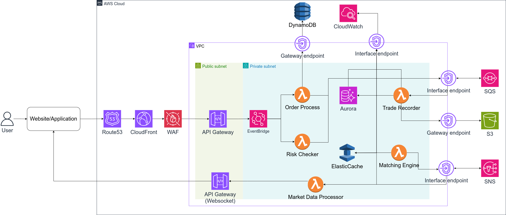

# Problem 2: Building Castle In The Cloud

# Highly Available Trading System Architecture

## Overview Diagram

---

### 1. Elaboration on the Reason Each Cloud Service is Used and Alternatives Considered

- **Route 53**:
  - **Reason**: AWS DNS service for reliable, low-latency domain resolution (~6ms) and seamless integration with CloudFront.
  - **Alternatives**: Cloudflare DNS (faster but less AWS integration), Google Cloud DNS (similar but less AWS-native).

- **CloudFront**:
  - **Reason**: CDN to cache static content (HTML, CSS, JS), reducing latency (~6ms) and improving user experience.
  - **Alternatives**: Azure CDN (less AWS integration), S3 bucket

- **WAF**:
  - **Reason**: Protects API Gateway from attacks (SQL injection, DDoS) with low overhead (~1ms).
  - **Alternatives**: Cloudflare WAF (similar but external).

- **API Gateway (REST)**:
  - **Reason**: Handles user requests, scales automatically, and integrates with EventBridge (~10ms).
  - **Alternatives**: ALB (more control but complex), Kong (open-source but needs management).

- **API Gateway (WebSocket)**:
  - **Reason**: Pushes real-time data (order book, last price) to users, serverless.
  - **Alternatives**: WebSocket on EC2 (needs management).

- **EventBridge**:
  - **Reason**: Serverless event bus to route events from API Gateway to Lambda, highly scalable.
  - **Alternatives**: SNS (simpler but less flexible),Amazon MSK, Confluent, Amazon Kinesis

- **Lambda (Order Processor, Risk Checker, Matching Engine, Market Data Processor, Trade Recorder)**:
  - **Reason**: Serverless compute, auto-scales, low latency, cost-effective.
  - **Alternatives**: EC2 (more control but needs management), Fargate (container-based, higher latency), EKS (more complex for maintainance).

- **SQS**:
  - **Reason**: Decouples Order Processor/Risk Checker from Matching Engine, ensures reliable message delivery (~10ms).
  - **Alternatives**: RabbitMQ (needs management), Kafka (complex setup).

- **SNS**:
  - **Reason**: Publishes trade events from Matching Engine to Market Data Processor (~10ms), fan-out messaging.
  - **Alternatives**: SQS (no fan-out), Kafka (complex setup).

- **ElastiCache (Redis)**:
  - **Reason**: In-memory storage for order book, low-latency access for Matching Engine/Market Data Processor.
  - **Alternatives**: Memcached (simpler but less features), DynamoDB (higher latency).

- **Aurora**:
  - **Reason**: Relational database for trade/transactional storage, supports high write throughput, Multi-AZ for high availability.
  - **Alternatives**: MySQL RDS (cheaper but less scalable), DynamoDB (faster but not relational).

- **DynamoDB**:
  - **Reason**: Stores user balances, scales for high read/write (~1-5ms), serverless.
  - **Alternatives**: Aurora (relational but slower).
- **S3**:
  - **Reason**: Stores long-term trade data, cost-effective.
  - **Alternatives**: MinIO(self-host), iDrive.

- **Gateway Endpoints (DynamoDB, S3)**:
  - **Reason**: Secure, low-latency access to DynamoDB/S3 from VPC without Internet.
  - **Alternatives**: NAT Gateway (costly), public endpoints (less secure).

- **Interface Endpoints (SQS, SNS, API Gateway)**:
  - **Reason**: Secure, low-latency access to SQS/SNS/API Gateway from private subnets.
  - **Alternatives**: NAT Gateway (costly), public endpoints (less secure).
- **CloudWatch**:
  - **Reason**: Monitors system performance (metrics, logs, events) for all resources, enabling proactive scaling and debugging (~10ms for sending metrics/logs).
  - **Alternatives**: Datadog (more features but costly), Prometheus (open-source but needs management).
---

### 2. System Flow Description

- **User Request**: User sends an order via Website/Application.
- **Routing**: Route 53 resolves DNS, CloudFront caches content, WAF filters requests.
- **Order Submission**: API Gateway (REST) receives the request and sends it to EventBridge.
- **Order Processing**: EventBridge routes the event to Order Processor (Lambda), which validates the order.
- **Risk Check**: Order Processor sends the order to Risk Checker (Lambda) for validation.
- **Matching**: Risk Checker sends the order to Matching Engine (Lambda) via SQS, which matches the order using ElastiCache.
- **Trade Notification**: Matching Engine publishes the trade to SNS.
- **Real-Time Update**: Market Data Processor (Lambda) receives the trade via SNS, updates the order book from ElastiCache, and sends real-time data to API Gateway (WebSocket) via Interface Endpoint.
- **User Notification**: API Gateway (WebSocket) pushes the data (e.g., order book, last price) to the user.
- **Trade Storage**: Trade Recorder (Lambda) stores the trade in Aurora and S3 via Gateway Endpoints.
- **Monitoring**: All components (Lambda, Aurora, ElastiCache, SQS, SNS, API Gateway) send metrics and logs to CloudWatch via Interface Endpoints (for VPC resources) or directly (for services outside VPC).
---

### 3. Plans for Scaling When the Product Grows Beyond the Current Setup

- **Increase Availability Zones (AZs)**:
  - Add more AZs (e.g., `us-east-1c`, `us-east-1d`) for Lambda, ElastiCache, and Aurora to distribute load and enhance fault tolerance.
  - **Impact**: Reduces risk of AZ failure, increases capacity for Lambda invocations.

- **Replace Lambda with EKS for Compute**:
  - **Current**: Lambda handles compute (Order Processor, Risk Checker, Matching Engine, Market Data Processor, Trade Recorder) with 50 concurrent executions for 500 rps (~10ms/invocation).
  - **Scaling with EKS**: If the application grows too large (e.g., 50,000 rps), replace Lambda with Amazon EKS to run containerized microservices (e.g., using Kubernetes pods for each component).
    - **Implementation**:
      - Deploy microservices (Order Processor, Risk Checker, etc.) as containers in EKS clusters across multiple AZs.
      - Use EKS auto-scaling (Horizontal Pod Autoscaler) to scale pods based on CPU/memory usage (e.g., 500 pods for 50,000 rps, assuming ~100 rps/pod).
      - Integrate EKS with EventBridge, SQS, SNS, and API Gateway using Interface Endpoints.
    - **Benefits**:
      - Greater control over compute resources (e.g., CPU, memory allocation).
      - Handles higher throughput (e.g., 50,000 rps) with fine-tuned scaling.
      - Supports complex workloads (e.g., stateful applications, custom runtime).
    - **Trade-offs**:
      - Increased latency: ~15-20ms per request (due to container overhead) vs. ~10-15ms with Lambda.
      - Higher management overhead: Requires managing EKS clusters, Kubernetes configurations, and container images.
      - Cost: ~$0.10/hour per EKS cluster, plus EC2 costs for worker nodes.

- **ElastiCache and Aurora Sharding**:
  - Add read replicas for ElastiCache and Aurora in new AZs.
  - Shard ElastiCache for order book (e.g., by trading pair) and Aurora for trades (e.g., by user) to handle increased load.

- **API Gateway Throttling and Caching**:
  - Current: Handles 500 rps (~10ms).
  - Increase throttling limits (default 10,000 rps) and use caching for WebSocket connections to reduce load.

- **SQS and SNS Scaling**:
  - Current: Handles 500 rps (~10ms).
  - Use multiple queues/topics (e.g., per trading pair) to distribute load across SQS/SNS.

- **DynamoDB Auto-Scaling**:
  - Current: Handles 500 rps (~1-5ms).
  - Enable auto-scaling for read/write capacity (e.g., 10,000 RCU/WCU for 10,000 rps).

- **CloudWatch Scaling**:
  - Current: Handles metrics/logs for 500 rps (~10ms to send).
  - Increase Interface Endpoint capacity (supports thousands of req/s) and set up CloudWatch Alarms for proactive scaling (e.g., p99 latency >100ms, Lambda throttling).
  - Set alarms for p99 latency (>100ms), Lambda errors, Aurora CPU (>80%), and ElastiCache memory (>80%) to scale resources proactively.

---

### 4. Why the System Meets the Constraints (Estimate)

#### 4.1. Latency (p99 < 100ms)
- **Latency Breakdown**:
  - Route 53 + CloudFront + WAF: ~6ms (DNS resolution and CDN caching).
  - API Gateway (REST): ~10ms (request handling).
  - EventBridge: ~10ms (event routing).
  - Order Processor (Lambda): ~15ms (order validation).
  - Risk Checker (Lambda): ~10ms (risk validation).
  - SQS: ~10ms (message queuing).
  - Matching Engine (Lambda): ~10ms (order matching).
  - ElastiCache (read/write): ~1ms (order book access).
  - SNS: ~10ms (trade event publishing).
  - Market Data Processor (Lambda): ~10ms (market data processing).
  - ElastiCache (read): ~1ms (order book read).
  - API Gateway (WebSocket) via Interface Endpoint: ~10ms (real-time data push).
  - **Total Estimated Latency**: ~93ms, which meets the p99 < 100ms requirement.

#### 4.2. Throughput (500 rps)
- **Lambda**:
  - 500 rps requires ~50 concurrent executions (assuming ~10ms/invocation).
  - Lambda supports up to 1,000 concurrent executions by default, easily handling 500 rps.
- **API Gateway**:
  - Default limit: 10,000 rps, supports 500 rps with no issues.
- **SQS/SNS**:
  - SQS/SNS handle 3,000 messages/s, supporting 500 rps.
- **ElastiCache/Aurora**:
  - ElastiCache and Aurora support thousands of req/s, handling 500 rps.
- **DynamoDB**:
  - 500 rps requires ~500 RCU/WCU, auto-scales to 10,000 RCU/WCU if needed.
- **Conclusion**:
  - The system supports 500 rps with current resources, with capacity to scale further.

#### 4.3. Why It Meets Constraints
- **p99 < 100ms**: The total latency (~93ms) is below 100ms, even with all components in the critical path. Interface Endpoints (~10ms) ensure low-latency communication within the VPC.
- **500 rps**: All services (Lambda, API Gateway, SQS/SNS, ElastiCache, Aurora, DynamoDB) are serverless or highly scalable, handling 500 rps well within their default limits.

---